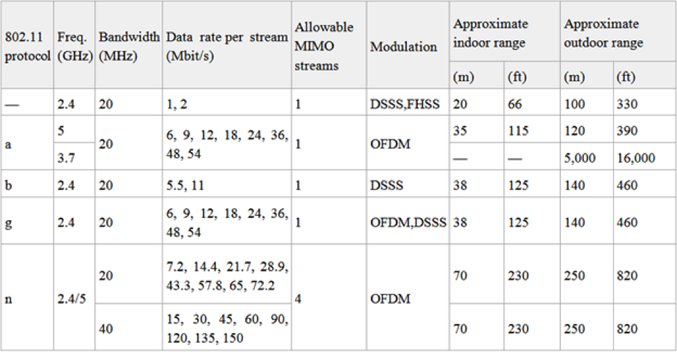
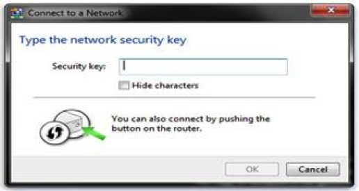
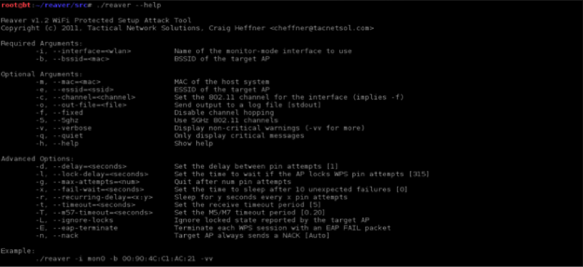
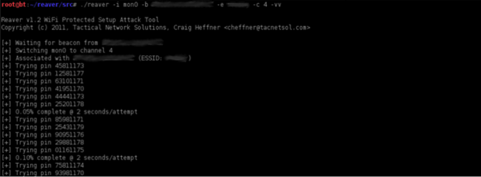

Source: http://www.netstumbler.com/2013/01/18/wi-fi-security-the-rise-and-fall-of-wps/ Copyright © Netstumbler.com 2005-2014

# Wi-Fi Security – The Rise and Fall of WPS

Wireless local-area networks which are also referred to as WLANs or Wi-Fi are prevalent these days. They are so popular that they
can be found installed in offices, colleges, hotels, cafes, and even homes. There are many Wi-Fi product vendors and service
providers, providing different products with different services and features. The main reason behind them being so popular is the
convenience, mobility and ease of implementation they provide compared to the wired network. The end user can easily access the
network without the hassle of managing the wires.

Wireless networks are basically based on the Institute of Electrical and Electronics Engineers (IEEE) 802.11 set of standards for
WLANs. Following is the list of the IEEE 802.11 network protocol standards.

## Protocols


|:--:|
| *Figure 1. 802.11 Network Standards (source: http://www.wikipedia.org)* |

Some years back, wireless networks were only a niche technology used for very specific applications. But nowadays they are
everywhere and every now and then we find a new Wi-Fi access point through our smart phones, tablets or laptops – most of which
are not even secure.

Most of us have used these access points at some point in time to access the Internet without realizing how much (In)security
they provide.

> An insecure Wi-Fi network poses a threat not only to the owner but to every user that accesses it. The first line of defense for a Wi-Fi network is encryption, which encrypts the data transmitted between the Wi-Fi enabled device (smart phone, tablet, laptop etc.) and the wireless router. The Wireless Protected Access (WPA) protocol and more recent WPA2 have replaced the older and less-secure practice of Wireless Encryption Protocol (WEP). It is better to go with WPA2 as WEP is relatively easy to crack.  Wi-Fi Protected Access (WPA) and Wi-Fi Protected Access 2 (WPA2) are two security protocols and security certification programs developed by the Wi-Fi Alliance to secure wireless computer networks by providing encryption mechanisms. But common users know little about wireless security and are scared by the available options to set up these methods.

Because of this unawareness and implementation issues with these protocols, in 2007 Wi-Fi Alliance came up with Wi-Fi Protected
Setup (WPS) which allowed home users to easily add new devices to an already existing Wi-Fi network without entering long
passphrases.

Wi-Fi Protected Setup (WPS), originally known as Wi-Fi Simple Config, is a computing standard that attempts to allow easy
establishment of a secure wireless home network. Almost all major Wi-Fi product vendors (Cisco/Linksys, Netgear, D-Link, Belkin,
Buffalo, Technicolor, etc.) have WPS-certified devices. WPS is activated by default on almost all the WPS supporting devices. The
main purpose of the standard is on providing usability along with security.

## Usage Methods

WPS provides four usage modes for adding a new device to an existing network, which are explained below. But first some
terminology that will used in the explanation:

#### Terminology:

- Enrollee: A new device that needs to be added to the network and does not have settings for the wireless network.

- Registrar: One which provides wireless settings to the enrollee.

- Access Point (AP): One which provides normal wireless network hosting and acts as middleware to pass messages between the
enrollee and the registrar.

The four modes provided by WPS can be classified into two groups: In-band and Out-of-band.

This classification is made based upon the channel utilized for the information transfer.

### In-Band modes:

Currently only these two modes are covered by WPS certification.

### Push-Button-Connect (PBC):

The user merely has to push a button, either an actual or virtual one, on both the Access Point (or a registrar of the network)
and the new wireless client device (enrollee). Support of this mode is mandatory for Access Points but optional for connecting
devices. Figure 2 shows a Windows 7 machine as an enrollee. PBC on the AP will only be active until authentication has succeeded
or timed-out after two minutes (or whatever amount of time the vendor has specified). This option is called wps_pbc in wpa_cli
(text-based frontend) which interacts with wpa_supplicant; wpa_supplicant is a WPA Supplicant for Linux, BSD, Mac OS X, and
Windows with support for WPA and WPA2.


|:--:|
| *Figure 2. Activated virtual push button (Windows 7: Enrollee)* |
_Source: http://sviehb.files.wordpress.com/2011/12/viehboeck_wps.pdf_

### PIN Mode:

In this method a Personal Identification Number (PIN) has to be read from either a label or the display unit on the new wireless
device. Figure 3 shows a WPS PIN on the label of a D-Link router. This PIN must then be inputted at the representant of the
network (usually AP). Alternately, a PIN on the Access Point may be entered into the new device. This can also be explained on
the basis of registrar, as following.

### Internal Registrar

The user enters the PIN of the Wi-Fi adapter into the web interface of the AP. This option is called wps_pin in wpa_cli.

### External Registrar

The user enters the PIN of the AP into a form on the client device (e.g. computer).

This option is called wps_reg in wpa_cli.

The PIN Method is a mandatory standard method; every Wi-Fi Protected Setup (WPS) certified product needs to support it.


|:--:|
| *Figure 3.WPS PIN on D-Link router* |
_Source: http://sviehb.files.wordpress.com/2011/12/viehboeck_wps.pdf_

### Out-of-Band modes:

These two modes are not covered by WPS certification.

### Near-Field-Communication (NFC) method:

In this method the user merely has to bring the new client adjacent to the Access Point to permit a near field
communication among the two devices. The NFC method offers strong defense against adding an unintended device to the network.
Support of this mode is optional and is not widely deployed.

### USB method:

In this method the user uses a USB drive to transfer data between the new client device and the Access Point of the network.
Support of this mode is optional, but denounced.

## Protocol

Wi-Fi Protected Setup doesn’t enhance security features to devices. It simply makes the existing security features easy to
enable and configure. One of the key elements of the WPS protocols is Extensible Authentication Protocol (EAP). EAP is
an authentication framework often used in wireless networks and Point-to-Point connections. It provides for the transport and
usage of keying material and parameters generated by EAP methods.

The WPS protocol consists as a sequence of EAP message exchanges that are initiated by a user action and relies on an exchange of
descriptive information that should precede that user’s action. This descriptive information is transmitted through a
new Information Element (i.e., an information component which when combined with other information provides the required
information product) that is added to the beacon (periodically send management frame by AP), probe response and optionally to the
probe request and association request/response messages.

IEs will hold the possible and the currently installed, configuration methods of the device other than purely
informative type-length-values (TLV).

A human trigger is required to initiate the actual session of the protocol after the identification of the device’s
capabilities on both the ends. The session consists of 8 messages followed by a message to indicate the protocol is completed (in
case of a successful session). The exact stream of messages may change when configuring various kinds of devices (AP or STA).

Until very recently this protocol was used to provide the users with a feature of easy implementation of security on their Wi-Fi
networks, but a recently discovered flaw has again put the wireless networks, and hence the users, at risk.

## Security Issue

In December 2011 a freelance information security researcher Stefan Viehböck reported a design and implementation flaw in WPS
that makes it vulnerable to a very basic hacking technique: brute-force attacks, feasible to perform against WPS-enabled Wireless
networks. It can be simply understood as an attacker trying thousands of combinations in rapid sequence until he/she happens on
the correct 8-digit PIN that allows authentication to the device. A successful attack on WPS allows unauthorized user to gain
access to the network. The research paper of Viehböck can be found
at http://sviehb.files.wordpress.com/2011/12/viehboeck_wps.pdf. This vulnerability was also independently uncovered by Craig
Heffner of Tactical Network Solutions, and involves how the router responds when incorrect PINs are inputted. When a PIN is
entered, the router implementing WPS indicates whether the first or second halves of the PIN are correct or not.

The vulnerability revolves around the acknowledgement messages transmitted between the registrar and enrollee during the
validation process of a PIN. The PIN, which is printed on the side label of each WPS-enabled Wi-Fi router, is an 8 digit number.
As the last digit is a checksum of the previous digits,^
there are seven unknown digits in each PIN, yielding a total of 10^7 = 10,000,000 possible combinations. The first and second
halves of the PIN are separately validated and reported by the registrar when an enrollee tries to gain access through the PIN.

Now the maximum number of guesses required for PIN recovery is 11,000 (10^4=10,000 from the first half + 10^3=1,000 from the
second half). This is a drastic reduction of the orders of degreea from the number of PINs that would have to be tested in the
absence of the design flaw (i.e. 10^7=100,000,000). The result of this flaw is the presence of a practical attack which can be
finished within hours. The difficulty of exploiting this flaw is that it is dependent on the implementation of WPS by the vendor,
as Wi-Fi router manufacturers could guard against this attacks by slowing down or disabling the WPS feature after some failed PIN
validation efforts.

Two tools have been developed as proof of concept to demonstrate that the attack is practical. Tactical Network Solutions, the
Maryland based firm that released the first tool ‘Reaver’, states that they are aware of the vulnerability since early 2011.
Tactical Network Solutions decided to release the tool after the vulnerability was made public. It is also selling a commercial
version called ‘Reaver Pro’ with some more features. Reaver is hosted on Google Code at http://code.google.com/p/reaver-wps/.
Its authors say that it can recover a router’s plain-text WPA or WPA2 password in 4 to 10 hours, depending on the access point.

The second tool is a PoC brute force tool implemented in Python and is a bit faster than Reaver, but supports less wireless
adapters, as stated on the author’s website (http://sviehb.wordpress.com/). This tool can be found
at http://dl.dropbox.com/u/22108808/wpscrack.zip.

### Reaver

Reaver, developed by Tactical Network Solutions, runs on Linux. It aims the external registrar functionality mandated by the
Wi-Fi Protected Setup requirement. It executes a brute force attack against an access point’s Wi-Fi Protected Setup (WPS) pin
number. Once the WPS pin is found, an attacker can recover the WPA PSK and alternately reconfigure the AP’s wireless settings
which could lead towards an insecure network. Although Reaver does not support reconfiguring the AP, this can be accomplished
with wpa_supplicant once the WPS pin is recovered. Reaver requires the libpcap (packet capture and transmission) and libsqlite3
(database) libraries and can be built and installed by running the commands:
``` sh
./configure
make
make install
```
To remove everything installed/created by Reaver, the following command can be used:
`make distclean`

Once installed the tool can simply be started using the command:
`./reaver`

The `–help` argument can be used to show all the arguments available within the tool. Figure 4 shows the help list of the
Reaver.


|:--:|
| *Figure 4. Help list of Reaver* |
_(Source: http://www.hack4fun.eu/2012/01/reaver-wps-wpscrack/)_

The only requirement it has is a wireless card capable of raw packet injection. To start the process the wireless card must be
put on monitor mode. This can be easily done using the airmon-ng tool from the wireless security testing aircrack-ng tool suite
as shown below.
`airmon-ng start wlan0`

The only essential arguments to Reaver are the interface name and the BSSID of the target AP, an example of which is shown below.
`reaver -i mon0 -b 00:01:02:03:04:05`

Sometimes Reaver just tries the same pin over and over again. This might be because WPS is not enabled on the AP. Run the walsh
tool (included in the Reaver-1.3 release) to scan for WPS-enabled APs and make sure the target AP is listed.

For extra information output, the verbose option may be provided using the argument ‘–v’. Providing the verbose option
twice (-vv) will increase verbosity and display each pin number as it is attempted as shown in Figure 5.


|:--:|
| *Figure 5. Reaver in action* |
_(Source: http://www.hack4fun.eu/2012/01/reaver-wps-wpscrack/)_

To speed up the attack the delay between pin attempts can be disabled by adding `–d 0` on the command line (default delay: 1
second).

`reaver -i mon0 -b 00:01:02:03:04:05 -vv -d 0`

Another option that can speed up an attack is `–dh-small`. This option tells Reaver to use small Diffie-Hellman secret
numbers in order to shrink the computational load on the target AP. In case the attacker does not want to reveal his/her MAC
address, Reaver also supports MAC spoofing with the `–mac` option, but it must be ensured that the MAC address of your
wireless card’s physical interface (wlan0) must be changed – not the monitor mode interface (usually mon0) – otherwise the
attack won’t work. Reaver keeps on brute forcing the PINs until a successful attempt. It has been stated that some
models/vendors/ISPs come pre-configured with a default pin. Some common pins are 12345670, 00005678, 01230000, etc. Reaver
attempts known default pins first as a better heuristic. Figure 6 shows a successfully cracked WPS PIN in 32,286 seconds.


|:--:|
| *Figure 6. Successful Recovery* |
_(Source:http://www.hack4fun.eu/2012/01/reaver-wps-wpscrack/)_

Due to interference or low signal strength Reaver sometimes can’t associate with the AP. It might also be a driver issue.

Below is a list of wireless drivers tested by Reaver:

Supported:

The following wireless drivers have been tested or reported to work successfully with Reaver:
  * ath9k
  * rtl8187
  * carl19170
  * ipw2000
  * rt2800pci
  * rt73usb

Partially Supported:

The following wireless drivers have had mixed success, and may or may not work depending on your wireless card:
  * ath5k
  * iwlagn
  * rtl2800usb
  * b43

Not Supported:

The following wireless drivers/cards have been tested or reported to not work properly with Reaver:

  * iwl4965
  * RT3070L
  * Netgear WG111v3

Technically more than one instance of Reaver can be run against an AP, but this approach is flawed as it will only result in a
double resource load on AP. Reaver advanced options (using ‘–a’ attribute) can be utilized to speed up the attack.
Mitigation
End users can disable WPS to prevent an attack, but because of the unawareness most people do not turn it off. Some access points
don’t even provide an option to disable WPS.

Vendors can mitigate the flaw by introducing sufficiently long lock down periods (after unsuccessful attempts) to make the attack
impractical to implement. This will require a new firmware release. Vendors also need to intensively test the protocols before
implementing them on their devices, so that such flaws don’t come up in the future.

## Conclusion

Today we are all surrounded by many Wi-Fi networks and have used them at some point in time without realizing the issues of the
security. The issues discussed in this article are not the only issues related to wireless security, but a recent and major one
affecting the privacy of the end users.

As we already know, almost all major router/AP vendors have WPS-certified devices and WPS–PIN (External Registrar) is mandatory
for certification, which makes a lot of devices vulnerable to such an attack.

Having a sufficiently long lock-down period (vendor mitigation method) is most likely not a requirement for WPS certification for
the device. However it should be a requirement in the new specifications. The vendors need to release new firmware to eliminate
the issue. The main argument this issue presents before us is that such other flaws might be already present in other
devices/protocols and misused by malicious intruders, hence the only safeguard we need to take is awareness among end users. Also
the certifying authorities and the vendors need to thoroughly test the devices/protocols before implementation so that security
features ultimately don’t lead towards insecurity.

Sudhanshu Chauhan is a security researcher for InfoSec Institute. InfoSec Institute is a security certification company that has
trained over 15,000 people including popular CEH and CCNA certification courses.
